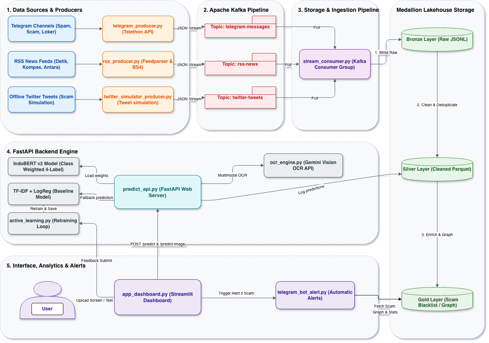
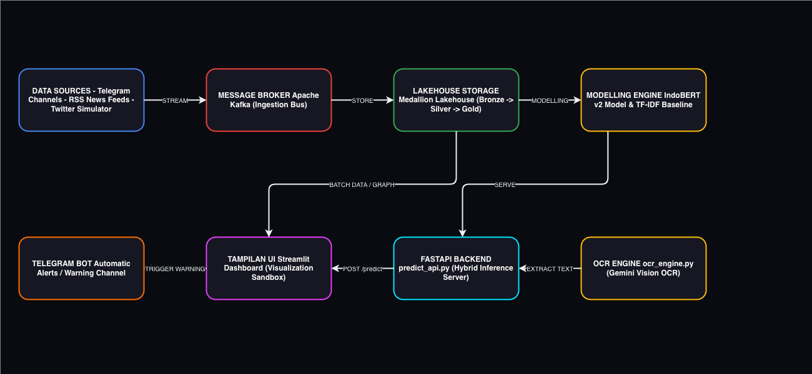
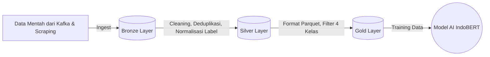
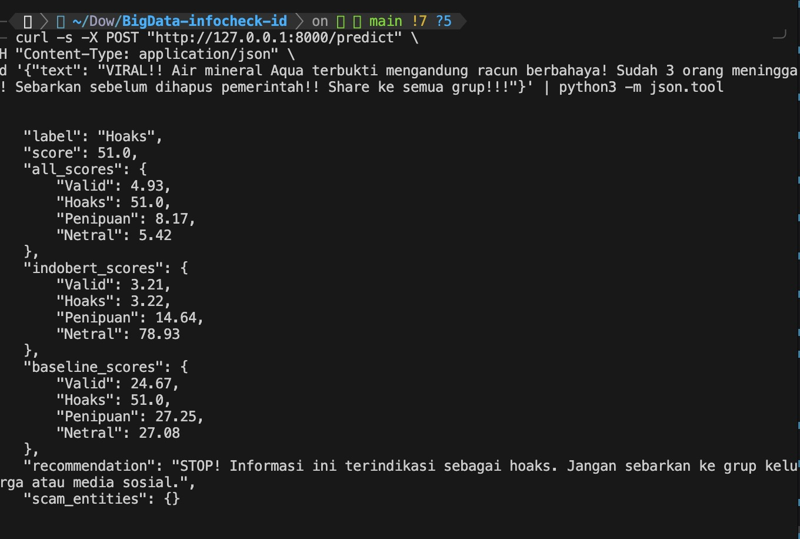
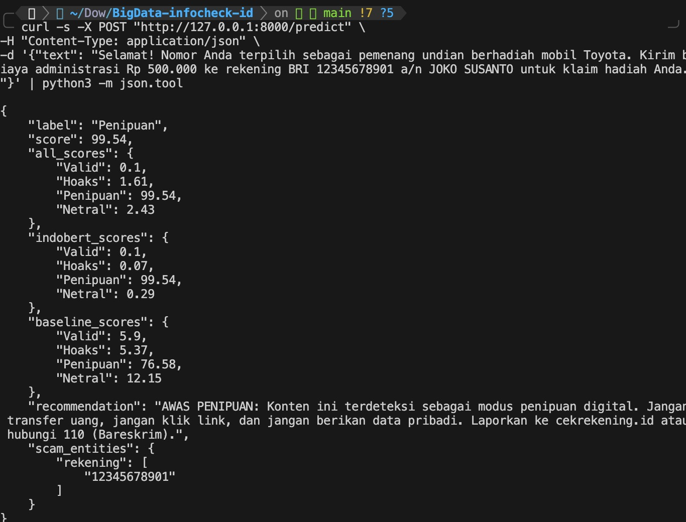
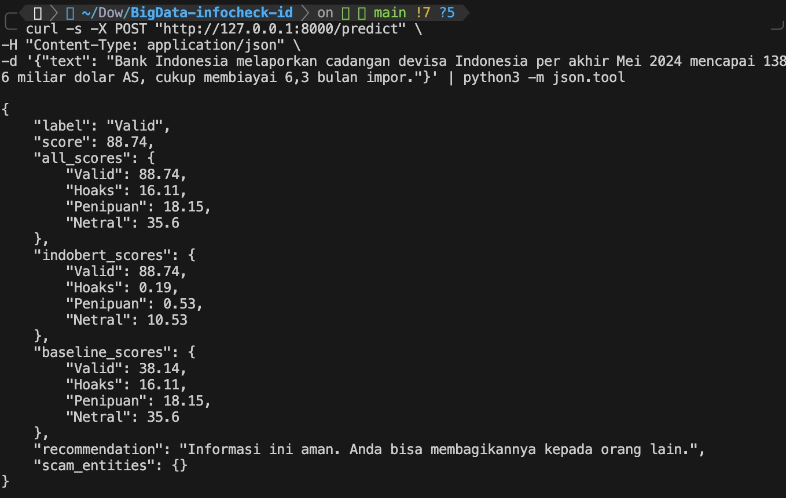
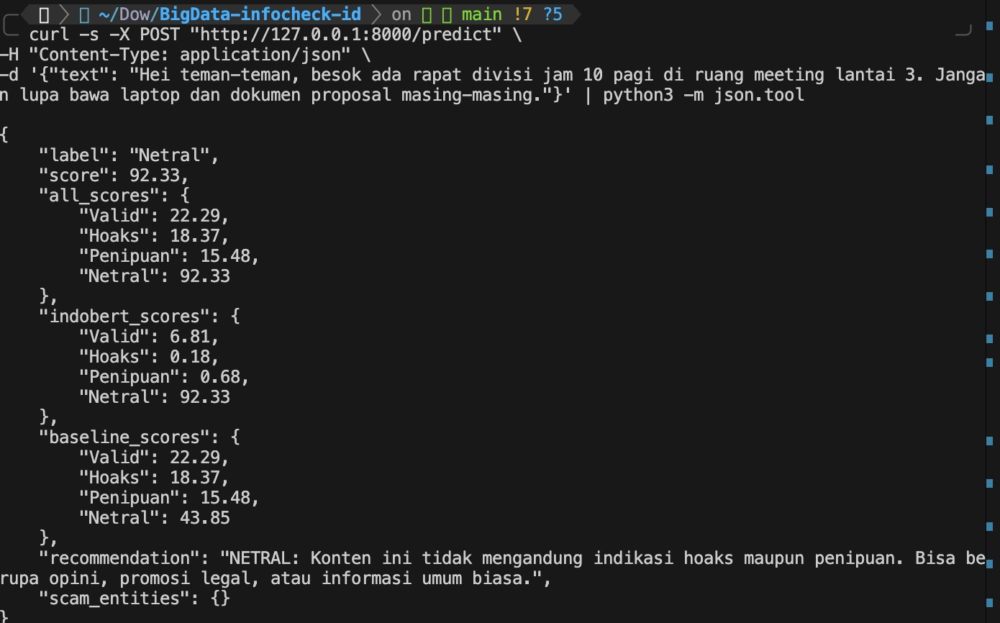
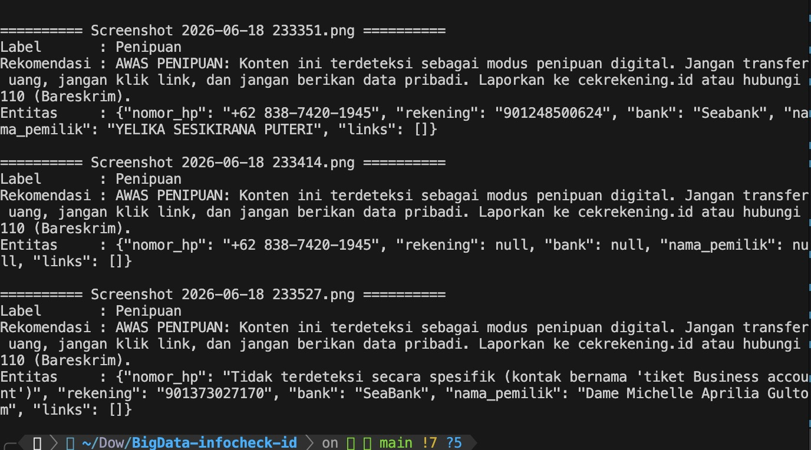

# InfoCheck ID — Big Data Hoaks & Penipuan Detector

**Sistem deteksi hoaks dan penipuan berbasis Big Data untuk konten berbahasa Indonesia**

## Daftar Isi

1. [Gambaran Umum Proyek](#gambaran-umum-proyek)
2. [Arsitektur Sistem](#arsitektur-sistem)
3. [Pembagian Tugas Anggota](#pembagian-tugas-anggota)
4. [Prasyarat dan Instalasi](#prasyarat-dan-instalasi)
5. [Anggota 1 — Pengumpulan Data (Data Ingestion)](#anggota-1--pengumpulan-data-data-ingestion)
6. [Anggota 2 — Kafka Stream Processing](#anggota-2--kafka-stream-processing)
7. [Anggota 3 — NLP, API dan Model (Inti Sistem)](#anggota-3--nlp-api-dan-model-inti-sistem)
8. [Anggota 4 — Kafka Stream Consumer & Telegram Bot](#anggota-4--kafka-stream-consumer--telegram-bot)
9. [Anggota 5 — Visualisasi, Dashboard & API Bridge](#anggota-5--visualisasi-dashboard--api-bridge)
10. [Konfigurasi Environment Variables](#konfigurasi-environment-variables)
11. [Menjalankan Seluruh Sistem (Panduan End-to-End)](#menjalankan-seluruh-sistem-panduan-end-to-end)
12. [Dokumentasi API Endpoint](#dokumentasi-api-endpoint)
13. [Deployment dengan Docker](#deployment-dengan-docker)
14. [Struktur Direktori Lengkap](#struktur-direktori-lengkap)
15. [Troubleshooting](#troubleshooting)

---

## Gambaran Umum Proyek

**InfoCheck ID** adalah platform analisis Big Data real-time yang dirancang untuk **mendeteksi, mengklasifikasikan, dan melawan penyebaran hoaks serta penipuan digital di Indonesia**. Sistem ini memproses data streaming dari berbagai sumber (RSS berita, Telegram, Twitter/X) menggunakan arsitektur **Medallion Lakehouse** (Bronze — Silver — Gold) berbasis Apache Kafka.

## Identifikasi Masalah & Relevansi Big Data (Konsep 5V)

Penyebaran hoaks dan penipuan daring (seperti phising, lowongan kerja palsu, dan scam tiket konser) di Indonesia telah mencapai titik kritis. Data kuantitatif dari Kominfo mencatat ribuan isu hoaks baru setiap tahunnya yang merugikan masyarakat triliunan rupiah. Solusi tradisional tidak lagi mumpuni karena karakteristik data saat ini membutuhkan pendekatan **Big Data (5V)**:

1. **Volume**: Data teks, chat, dan gambar penipuan yang beredar di platform Telegram dan berita nasional mencapai jutaan pesan per hari.
2. **Velocity**: Kecepatan penyebaran hoaks sangat tinggi (*real-time*). Sistem harus mampu mendeteksi dan memfilter pesan dalam hitungan milidetik sebelum pesan tersebut viral.
3. **Variety**: Format data sangat beragam. Terdapat data teks terstruktur (berita), semi-terstruktur (JSON dari Telegram API), hingga data tidak terstruktur (Gambar/Screenshot penipuan).
4. **Veracity**: Tingkat keandalan informasi sangat bervariasi. Dibutuhkan model AI (IndoBERT) untuk memvalidasi tingkat kebenaran (Veracity) dari suatu teks.
5. **Value**: Hasil akhir (Value) berupa *dashboard* statistik *real-time* dan Bot interaktif yang menyelamatkan masyarakat dari kerugian finansial akibat penipuan.

**Gap Analisis:** Saat ini, sistem pengecekan fakta di Indonesia (seperti TurnBackHoax) masih mengandalkan pencarian manual oleh manusia (*human-in-the-loop*). Belum ada solusi terintegrasi yang mampu melakukan **pengecekan otomatis secara real-time** pada aliran *chat* dan mendeteksi teks di dalam gambar secara bersamaan.

---

### Kemampuan Utama

| Fitur | Keterangan |
|-------|------------|
| **4-Kelas Klasifikasi** | `Valid`, `Hoaks`, `Penipuan`, `Netral` |
| **Model Hybrid** | IndoBERT (deep learning) + TF-IDF Logistic Regression (baseline) |
| **OCR Analisis** | Deteksi penipuan dari screenshot menggunakan Gemini Vision 2.5 Flash |
| **Real-time Streaming** | Apache Kafka multi-topik (RSS, Telegram, Twitter) |
| **Active Learning** | Retraining otomatis model baseline dari feedback pengguna |
| **Komdigi Similarity** | Pencarian artikel hoaks terverifikasi menggunakan TF-IDF Cosine Similarity |
| **Ekstraksi Entitas** | Deteksi nomor HP, rekening, link penipuan secara otomatis |

---

## Arsitektur Sistem

### Diagram Arsitektur



### Diagram Alur



### Alur Data Sistem

```
+---------------------------------------------------------------------+
|                     DATA SOURCES (Bronze Layer)                      |
|   [RSS Feeds]  [Telegram Channel]  [Twitter/X]  [Screenshot/OCR]    |
+----------------------------------+----------------------------------+
                                   |  (Kafka Producers)
                                   v
+---------------------------------------------------------------------+
|              APACHE KAFKA — Message Broker (Silver Layer)            |
|      Topic: rss-news | telegram-messages | analyzed-news             |
+----------------------------------+----------------------------------+
                                   |  (Stream Consumer)
                                   v
+---------------------------------------------------------------------+
|              FASTAPI ENGINE — NLP Prediction (Anggota 3)             |
|   IndoBERT + TF-IDF Baseline + Komdigi Similarity + OCR Gemini      |
|   Endpoint: POST /predict | POST /predict-image | GET /stats         |
+-----------------+---------------------------------------------------+
                  |                            |
         (Feedback Loop)              (Results -> Kafka)
                  v                            v
+------------------------+     +-------------------------------------+
|   Active Learning      |     |          GOLD LAYER                  |
|   (Auto Retraining)    |     |   Visualisasi & Dashboard (Anggota 5)|
+------------------------+     +-------------------------------------+
```

**Justifikasi Teknologi:**
- **Apache Kafka**: Dipilih karena kemampuannya menangani *throughput* data *streaming* yang sangat tinggi dengan latensi rendah, serta *fault-tolerance* yang menjaga pesan tidak hilang.
- **Data Lakehouse (Parquet)**: Menggabungkan fleksibilitas Data Lake dan struktur Data Warehouse. Format Parquet dipilih karena penyimpanannya berbasis kolom (columnar), sehingga sangat efisien untuk kueri analitik dan melatih ulang model Machine Learning.
- **FastAPI**: Dipilih sebagai jembatan AI karena performanya yang sangat cepat (asynchronous) dibandingkan Flask/Django.


### Tumpukan Teknologi

| Layer | Teknologi |
|-------|-----------|
| **Data Ingestion** | `feedparser`, `telethon`, `requests` |
| **Message Broker** | Apache Kafka (`kafka-python-ng`) |
| **ML/DL Model** | IndoBERT (`indobenchmark/indobert-base-p2`), Scikit-learn |
| **AI OCR** | Google Gemini 2.5 Flash Vision API |
| **Backend API** | FastAPI + Uvicorn |
| **Dataset** | Komdigi Hoaks DB, RSS Cek Fakta, SMS Spam |
| **Containerization** | Docker |

---


### Identifikasi Masalah 

**Masalah yang diangkat:**
Penyebaran hoaks dan penipuan digital di Indonesia meningkat pesat melalui media sosial, platform chat, dan berita online. Masyarakat kesulitan membedakan informasi valid dari konten yang menyesatkan atau berbahaya secara finansial.

**Relevansi Big Data:**
- Volume data berita dari 18+ sumber RSS feed nasional yang dikumpulkan secara kontinu
- Velocity tinggi melalui streaming real-time Kafka dari Telegram, Twitter, dan RSS
- Variety mencakup teks berita, pesan chat, dan gambar screenshot (multimodal)
- Veracity menjadi inti permasalahan — menentukan kebenaran informasi

**Implementasi dalam proyek:**
- File `producers/rss_producer.py` — Ingestion dari 18 sumber berita nasional
- File `producers/telegram_producer.py` — Monitoring channel Telegram real-time
- File `producers/twitter_simulator_producer.py` — Simulasi data Twitter
- File `producers/scraper_kominfo.py` — Scraping database hoaks terverifikasi Komdigi

---

### Inovasi dan Kreativitas

**Aspek inovatif proyek:**

| Inovasi | Penjelasan |
|---------|------------|
| **Hybrid Model** | Menggabungkan IndoBERT (deep learning) dengan TF-IDF Logistic Regression (ML klasik) untuk prediksi yang lebih akurat |
| **4-Kelas Klasifikasi** | Tidak hanya Valid/Hoaks, tetapi menambahkan kelas Penipuan dan Netral untuk cakupan yang lebih luas |
| **OCR + NLP Pipeline** | Screenshot chat penipuan dianalisis dengan Gemini Vision, lalu hasilnya diproses ulang oleh model hybrid |
| **Komdigi Similarity** | Cross-referencing otomatis dengan database hoaks terverifikasi pemerintah menggunakan TF-IDF Cosine Similarity |
| **Active Learning** | Model baseline diperbarui secara otomatis berdasarkan koreksi/feedback pengguna tanpa perlu retraining manual |
| **Ekstraksi Entitas Penipuan** | Deteksi otomatis nomor HP, rekening bank, dan link mencurigakan dari teks dan screenshot |

**Implementasi dalam proyek:**
- File `api/predict_api.py` — Fungsi `predict_hybrid()` menggabungkan skor IndoBERT dan baseline
- File `api/ocr_engine.py` — Pipeline Gemini Vision untuk analisis screenshot
- File `api/komdigi_similarity.py` — TF-IDF index dan pencarian similarity
- File `ml/active_learning.py` — Retraining otomatis dari feedback

---

## Implementasi Data Lakehouse (Medallion Architecture)

Untuk menjamin kualitas data, keandalan sistem dalam skala besar (Big Data), dan memfasilitasi _machine learning_, proyek InfoCheck ID mengadopsi pola penyimpanan **Data Lakehouse** dengan **Medallion Architecture**. Pendekatan ini membagi data ke dalam tiga lapisan (layer) kualitas yang terus meningkat:



### 1. Bronze Layer (Raw Data / Data Mentah)
- **Tujuan:** Menyimpan data persis seperti aslinya dari berbagai sumber (RSS, Telegram, Twitter, API OCR Gemini) tanpa modifikasi apa pun. Ini bertindak sebagai *single source of truth* untuk sejarah data.
- **Karakteristik:** Data seringkali masih kotor, formatnya beragam (terstruktur maupun tidak terstruktur), dan disimpan dalam bentuk JSON mentah (misalnya `ocr_results.json` atau file log Kafka).
- **Keuntungan:** Jika terjadi kesalahan pada logika _processing_ di tahap selanjutnya, kita bisa selalu memproses ulang data dari awal karena data aslinya (Bronze) tidak pernah hilang.

### 2. Silver Layer (Cleaned & Conformed Data)
- **Tujuan:** Membersihkan, memfilter, dan menstandardisasi data mentah dari lapisan Bronze agar siap untuk dianalisis lebih lanjut.
- **Proses yang Terjadi:** 
  - Menghilangkan duplikasi berita atau pesan (*deduplikasi*).
  - Pembersihan teks (_Text Preprocessing_): menghapus emoji yang tidak perlu, membetulkan _typo_, menghapus spasi ganda, dan membuang karakter aneh (HTML tags).
  - Normalisasi kolom (misalnya mengubah semua format tanggal menjadi ISO 8601 standar).
- **Hasil Akhir:** Kumpulan data bersih (*dataset* perantara) yang lebih mudah untuk di-kueri oleh Data Analyst namun belum dikelompokkan secara agregat.

### 3. Gold Layer (Business / Aggregated Data)
- **Tujuan:** Menyajikan data tingkat akhir yang siap pakai (*consumption-ready*) untuk pelatihan (*training*) Model Machine Learning (IndoBERT) atau disajikan langsung ke Dashboard Visualisasi.
- **Proses yang Terjadi:**
  - Penyeimbangan Data (*Data Balancing*): Memfilter data menjadi 4 kelas absolut (Valid, Hoaks, Penipuan, Netral) yang masing-masing porsinya disamaratakan (25%) untuk mencegah model yang bias.
  - Penyimpanan ke format **Parquet** (seperti `final_dataset_balanced.parquet`). Format _columnar_ ini dipilih karena sangat efisien (ringan dan cepat) saat dibaca berulang kali (I/O optimization) selama proses _training_ model besar di GPU.
- **Hasil Akhir:** *Dataset* premium berkualitas tinggi yang menggerakkan sistem prediksi pintar dari InfoCheck ID.

---
### Teknik Analisis

**Teknik analisis yang digunakan:**

| Teknik | Detail |
|--------|--------|
| **Fine-tuned IndoBERT** | Pre-trained `indobenchmark/indobert-base-p2` di-fine-tune pada dataset balanced 4 kelas. Training 5 epoch, batch size 16, learning rate 2e-5, split 70/15/15 |
| **TF-IDF + Logistic Regression** | Model baseline dengan max 10.000 fitur, n-gram (1,2), class weight balanced |
| **Heuristic Boosting** | Keyword detection untuk kata-kata provokatif hoaks dan formal/resmi sebagai penguatan skor |
| **Cosine Similarity** | Pencarian artikel hoaks Komdigi terdekat menggunakan TF-IDF vectorizer dengan threshold 0.50 |
| **Gemini Vision OCR** | Analisis multimodal untuk mengekstrak teks dan mengklasifikasikan konten dari gambar screenshot |
| **Sentiment dan Sensasionalisme** | Deteksi konten sensasional dan analisis sentimen sebagai fitur tambahan |

**Implementasi dalam proyek:**
- File `scripts/kaggle_finetune_indobert.py` — Script training IndoBERT 4 kelas
- File `api/predict_api.py` — Hybrid prediction engine dan heuristic boosting
- File `api/komdigi_similarity.py` — TF-IDF cosine similarity search
- File `ml/nlp_baseline.py` — Training awal model baseline TF-IDF

---

### Inovasi Solusi 

**Solusi end-to-end yang dibangun:**

1. **API Prediksi Real-time** — FastAPI backend dengan 3 endpoint utama (`/predict`, `/predict-image`, `/stats`)
2. **Multimodal Input** — Mendukung analisis teks dan screenshot sekaligus
3. **Feedback Loop** — Pengguna dapat mengoreksi prediksi, data koreksi diakumulasi untuk retraining otomatis
4. **Recommendation Engine** — Setiap prediksi disertai rekomendasi tindakan spesifik per kelas
5. **Scam Entity Extraction** — Deteksi otomatis nomor HP pelaku, rekening tujuan, dan link phishing
6. **Dockerized Deployment** — Seluruh sistem dapat di-deploy menggunakan Docker dan Docker Compose

**Implementasi dalam proyek:**
- File `api/predict_api.py` — Endpoint `/predict` dan `/predict-image`
- File `ml/active_learning.py` — Feedback loop dan auto retraining
- File `Dockerfile` — Container-ready deployment
- Fungsi `get_recommendation()` dan `extract_scam_entities_from_text()` di `predict_api.py`

---

### K6 Demo Sistem

**Komponen yang dapat di-demo-kan:**

1. **Jalankan FastAPI** — Buka Swagger UI di `http://localhost:8000/docs`
2. **Test klasifikasi teks** — Kirim teks hoaks, penipuan, valid, dan netral via curl atau Swagger
3. **Test klasifikasi screenshot** — Upload gambar screenshot chat penipuan via endpoint `/predict-image`
4. **Jalankan Kafka streaming** — Tunjukkan data mengalir dari RSS Producer ke Consumer ke API
5. **Dashboard visualisasi** — Tunjukkan distribusi label dan timeline analisis real-time
6. **Active Learning** — Tunjukkan proses feedback dan retraining model baseline

**Command untuk demo:**
```bash
# Jalankan API
uvicorn api.predict_api:app --host 0.0.0.0 --port 8000 --reload

# Test prediksi hoaks
curl -X POST http://localhost:8000/predict \
  -H "Content-Type: application/json" \
  -d '{"text": "Akan ada pemadaman listrik global selama 9 hari! Sebarkan sebelum dihapus!"}'

# Test prediksi penipuan
curl -X POST http://localhost:8000/predict \
  -H "Content-Type: application/json" \
  -d '{"text": "Selamat! Anda menang undian. Transfer Rp150.000 ke rekening 1234567890 BCA a.n. Budi."}'

# Cek statistik
curl http://localhost:8000/stats
```

---

## Pembagian Tugas Anggota

| No | Peran | File Utama | Tanggung Jawab |
|----|-------|------------|----------------|
| **Anggota 1** | Data Collector | `producers/rss_producer.py`, `producers/scraper_kominfo.py` | Pengumpulan data dari RSS feed 18+ sumber berita nasional dan scraping dataset Komdigi |
| **Anggota 2** | Data Engineer | `producers/telegram_producer.py`, `producers/twitter_simulator_producer.py` | Ingestion data real-time dari Telegram channel dan simulasi Twitter, publish ke Kafka |
| **Anggota 3** | ML/NLP Engineer | `api/predict_api.py`, `api/komdigi_similarity.py`, `api/ocr_engine.py`, `ml/active_learning.py`, `scripts/kaggle_finetune_indobert.py` | Fine-tuning IndoBERT, API prediksi hybrid, OCR Gemini, Active Learning, Komdigi Similarity |
| **Anggota 4** | Stream Engineer | `consumers/stream_consumer.py`, `bot/telegram_bot.py` | Kafka Stream Consumer: baca data streaming, panggil API, publish hasil ke `analyzed-news`. Serta antarmuka Bot Telegram. |
| **Anggota 5** | Data Analyst | `frontend/` (dashboard), `api_bridge/` | Konsumsi topik `analyzed-news`, dashboard visualisasi real-time hasil analisis, dan REST API Bridge untuk frontend. |

---

## Prasyarat dan Instalasi

### Kebutuhan Sistem

- **Python** 3.10+ (disarankan 3.12)
- **Java** 11+ (untuk Apache Kafka)
- **Apache Kafka** 3.x
- **Git**
- **[Opsional]** Docker dan Docker Compose
- **[Opsional]** Akun Google AI Studio (untuk fitur OCR Gemini)
- **[Opsional]** Token Bot Telegram dari BotFather (jika ingin menjalankan fitur Bot)

> **💡 Tip Jalan Pintas:** Ingin cara instan? Kamu bisa langsung menggunakan Docker Compose untuk menjalankan Kafka, Zookeeper, dan API sekaligus tanpa install manual. Cukup jalankan perintah: `docker-compose up -d` (detailnya ada di bagian **Deployment dengan Docker**).

### 1. Clone Repository

```bash
git clone https://github.com/nadiakiranaa/BigData-infocheck-id.git
cd BigData-infocheck-id
```

### 2. Buat Virtual Environment

```bash
# Buat virtual environment
python -m venv venv

# Aktivasi (macOS/Linux)
source venv/bin/activate

# Aktivasi (Windows)
venv\Scripts\activate
```

### 3. Install Dependencies

```bash
pip install --upgrade pip
pip install -r requirements.txt

# Install tambahan untuk deep learning (IndoBERT)
pip install torch transformers accelerate

# Install tambahan untuk OCR Gemini
pip install google-genai pillow python-dotenv

# Install tambahan untuk baseline model
pip install joblib
```

### 4. Konfigurasi Environment Variables

Buat file `.env` di root proyek:

```dotenv
# Wajib untuk fitur OCR Gemini
GEMINI_API_KEY=your_google_gemini_api_key_here

# Wajib untuk Telegram Producer (Anggota 2)
TELEGRAM_API_ID=your_telegram_api_id
TELEGRAM_API_HASH=your_telegram_api_hash
TELEGRAM_PHONE=+62xxxxxxxxxx

# Wajib untuk Telegram Bot (Anggota 4)
TELEGRAM_BOT_TOKEN=your_telegram_bot_token_here

# Opsional
KAFKA_BOOTSTRAP_SERVERS=localhost:9092
API_BASE_URL=http://localhost:8000
```

---

## Anggota 1 — Pengumpulan Data (Data Ingestion)

### Deskripsi Tugas

Anggota 1 bertanggung jawab mengumpulkan data berita dari **18+ sumber RSS feed** terpercaya Indonesia mencakup berita umum, ekonomi, politik, cek fakta, berita kriminal, dan teknologi/keamanan siber. Data yang dikumpulkan langsung di-publish ke Apache Kafka topic `rss-news` dalam format JSON terstandar.

Sumber data yang diintegrasikan:

| Kategori | Sumber |
|----------|--------|
| Berita Umum/Ekonomi | Detik Ekonomi, Antara Ekonomi, CNBC Indonesia |
| Berita Politik | Detik News, Antara Politik, Tribun News |
| Cek Fakta/Hoaks | Liputan6 Cek Fakta, Turnbackhoax, Kompas Cek Fakta, Detik Cek Fakta, Tempo Cek Fakta, Merdeka Cek Fakta |
| Kriminal dan Penipuan Siber | Detik Hukum, Kompas Nasional, Antara Hukum, Tribun Techno |
| Keamanan Siber | Detik Inet, Kompas Tekno, Antara Tekno |

### Menjalankan RSS Producer

```bash
# Pastikan Kafka sudah berjalan (lihat bagian "Menjalankan Seluruh Sistem")

# Jalankan RSS Producer (polling setiap 60 detik)
python producers/rss_producer.py
```

**Output yang diharapkan:**
```
2026-06-26 22:00:00 - INFO - RSS Feed Kafka Ingestion service started.
2026-06-26 22:00:00 - INFO - Starting polling RSS feeds...
2026-06-26 22:00:01 - INFO - Parsing feed from: Detik Ekonomi (Category: news)
2026-06-26 22:00:02 - INFO - Ingested 5 new articles from Detik Ekonomi
...
2026-06-26 22:01:00 - INFO - Sleeping for 60 seconds...
```

### Menjalankan Scraper Komdigi (Dataset Builder)

```bash
# Scrape database hoaks Komdigi untuk dijadikan ground truth
python producers/scraper_kominfo.py
```

---

## Anggota 2 — Kafka Stream Processing

### Deskripsi Tugas

Anggota 2 bertanggung jawab menyediakan dua sumber data streaming tambahan:

1. **Telegram Producer** — Membaca pesan dari channel Telegram publik (saluran info hoaks, aduan penipuan) dan mempublishnya ke topic Kafka `telegram-messages`
2. **Twitter Simulator Producer** — Mensimulasikan data tweet berbahasa Indonesia untuk uji sistem tanpa API Twitter berbayar

### Setup Telegram Producer

Sebelum menjalankan, daftarkan aplikasi Telegram:
1. Kunjungi [my.telegram.org](https://my.telegram.org) dan login
2. Pilih **API development tools** dan buat aplikasi baru
3. Salin `api_id` dan `api_hash` ke file `.env`

```bash
# Jalankan Telegram Producer
# Pertama kali akan meminta nomor HP dan OTP Telegram (sekali saja)
python producers/telegram_producer.py
```

**Output yang diharapkan:**
```
INFO - Menghubungkan ke Telegram...
INFO - Berhasil terhubung sebagai: [Nama Pengguna]
INFO - Mulai memantau channel: [nama_channel]
INFO - Pesan baru diterima -> Publish ke Kafka topic 'telegram-messages'
```

### Menjalankan Twitter Simulator Producer

```bash
# Jalankan simulasi data Twitter (tidak memerlukan API key Twitter)
python producers/twitter_simulator_producer.py
```

---

## Anggota 3 — NLP, API dan Model (Inti Sistem)

### Deskripsi Tugas

Anggota 3 adalah inti dari seluruh sistem analisis InfoCheck ID. Bertanggung jawab atas:
- Fine-tuning model IndoBERT 4 kelas
- Membangun FastAPI engine prediksi hybrid
- Modul Komdigi Similarity (pencarian hoaks terverifikasi)
- Modul OCR Gemini (analisis screenshot)
- Sistem Active Learning (retraining otomatis)

### Label Klasifikasi (4 Kelas)

Sistem mengklasifikasikan konten ke dalam 4 kelas berikut:

> **Catatan untuk bukti klasifikasi:** Sertakan screenshot hasil prediksi untuk setiap kelas dalam laporan sebagai bukti sistem berjalan.

| Label | Deskripsi | Contoh Bukti |
|-------|-----------|--------------|
| **Valid** | Informasi terbukti benar, berasal dari sumber resmi/terpercaya | Berita BPS tentang pertumbuhan ekonomi, pengumuman resmi kementerian, laporan bank sentral |
| **Hoaks** | Berita/informasi palsu yang disebarkan tanpa motif finansial langsung | "Akan terjadi pemadaman listrik global 9 hari", teori konspirasi tanpa bukti, berita menyesatkan |
| **Penipuan** | Konten dengan motif penipuan finansial/data pribadi | Chat penipuan loker bodong, transfer palsu, link phishing, APK berbahaya, pinjol ilegal |
| **Netral** | Konten normal tanpa indikasi hoaks atau penipuan | Opini pribadi, promosi toko resmi, informasi umum sehari-hari, pengumuman biasa |

### Step 1 — Persiapkan Dataset

```bash
# Cek dataset yang tersedia
ls -lh dataset/

# Output dataset:
# dataset/final_dataset.csv              (dataset utama lengkap ~67MB)
# dataset/final_dataset_balanced.csv     (dataset balanced untuk training ~2.3MB)
# dataset/dataset_sms_spam_v1.csv        (dataset SMS spam)

# Jalankan script persiapan dataset (jika diperlukan)
python scripts/prepare_dataset.py
```

### Step 2 — Fine-Tuning IndoBERT

Model IndoBERT perlu dilatih menggunakan GPU melalui Google Colab atau Kaggle. Upload file `dataset/final_dataset_balanced.csv` dan jalankan script `scripts/kaggle_finetune_indobert.py`. Setelah training selesai, download hasilnya dan taruh di `model/indobert-infocheck-final/`.

**Konfigurasi Training:**

| Parameter | Nilai | Keterangan |
|-----------|-------|------------|
| `MODEL_NAME` | `indobenchmark/indobert-base-p2` | Pre-trained model dari HuggingFace |
| `NUM_LABELS` | `4` | Valid, Hoaks, Penipuan, Netral |
| `MAX_LENGTH` | `256` | Panjang token maksimum |
| `BATCH_SIZE` | `16` | Turunkan ke 8 jika out of memory |
| `EPOCHS` | `5` | Jumlah epoch training |
| `LR` | `2e-5` | Learning rate |
| **Split** | `70% / 15% / 15%` | Train / Validation / Test |

**Verifikasi model setelah training:**

```bash
# Pastikan file-file ini ada di folder model
ls model/indobert-infocheck-final/
# config.json  pytorch_model.bin  tokenizer.json  tokenizer_config.json  vocab.txt

# Cek jumlah label di config.json (harus 4)
python -c "import json; cfg=json.load(open('model/indobert-infocheck-final/config.json')); print('Num labels:', cfg.get('num_labels')); print('ID2Label:', cfg.get('id2label'))"
```

### Step 3 — Bangun Komdigi Similarity Index

```bash
# Bangun TF-IDF index dari database hoaks Komdigi (jalankan sekali saja)
python api/komdigi_similarity.py
```

**Output yang diharapkan:**
```
Loading database hoaks Komdigi...
Total artikel Komdigi: 5234
Index tersimpan ke 'komdigi_index.pkl'
```

### Step 4 — Jalankan FastAPI Engine

```bash
# Jalankan FastAPI Server (mode development)
uvicorn api.predict_api:app --host 0.0.0.0 --port 8000 --reload

# Atau tanpa auto-reload (mode produksi)
uvicorn api.predict_api:app --host 0.0.0.0 --port 8000 --workers 2
```

**Output yang diharapkan:**
```
INFO:     Loading models...
INFO:     Baseline TF-IDF model loaded successfully.
INFO:     IndoBERT model loaded successfully with 4 labels.
INFO:     Uvicorn running on http://0.0.0.0:8000 (Press CTRL+C to quit)
```

**Akses dokumentasi API interaktif:**
- Swagger UI: http://localhost:8000/docs
- ReDoc: http://localhost:8000/redoc

### Step 5 — Test Prediksi API

**Test klasifikasi HOAKS:**

```bash
curl -X POST http://localhost:8000/predict \
  -H "Content-Type: application/json" \
  -d '{"text": "Akan ada pemadaman listrik global selama 9 hari mulai minggu depan! Sebarkan sebelum dihapus pemerintah!"}'
```



**Test klasifikasi PENIPUAN:**

```bash
curl -X POST http://localhost:8000/predict \
  -H "Content-Type: application/json" \
  -d '{"text": "Selamat! Anda menang undian berhadiah motor. Transfer biaya admin Rp150.000 ke rekening 1234567890 BCA a.n. Budi."}'
```



**Test klasifikasi VALID:**

```bash
curl -X POST http://localhost:8000/predict \
  -H "Content-Type: application/json" \
  -d '{"text": "Bank Indonesia melaporkan pertumbuhan ekonomi kuartal I 2026 sebesar 5.12% berdasarkan data resmi BPS."}'
```



**Test klasifikasi NETRAL:**

```bash
curl -X POST http://localhost:8000/predict \
  -H "Content-Type: application/json" \
  -d '{"text": "Halo, hari ini cuaca cerah cocok untuk olahraga pagi. Semangat menjalani hari!"}'
```



**Cek statistik prediksi:**

```bash
curl http://localhost:8000/stats
```

**Contoh output prediksi:**
```json
{
  "label": "Penipuan",
  "score": 89.5,
  "all_scores": {
    "Valid": 2.3,
    "Hoaks": 5.1,
    "Penipuan": 89.5,
    "Netral": 3.1
  },
  "indobert_scores": {"Valid": 1.2, "Hoaks": 3.4, "Penipuan": 92.1, "Netral": 3.3},
  "baseline_scores": {"Valid": 5.1, "Hoaks": 8.2, "Penipuan": 80.4, "Netral": 6.3},
  "recommendation": "AWAS PENIPUAN: Konten ini terdeteksi sebagai modus penipuan digital...",
  "scam_entities": {
    "rekening": ["1234567890"],
    "nomor_hp": []
  }
}
```

### Step 6 — Analisis Screenshot (OCR Gemini)

```bash
# Convert gambar ke base64 dan kirim ke API
python -c "
import base64, json, requests
with open('path/to/screenshot.png', 'rb') as f:
    img_b64 = base64.b64encode(f.read()).decode()
resp = requests.post('http://localhost:8000/predict-image', json={'image_base64': img_b64})
print(json.dumps(resp.json(), indent=2, ensure_ascii=False))
"
```



### Step 7 — Jalankan Active Learning (Retraining Otomatis)

Active Learning dipicu otomatis oleh API saat feedback pengguna mencapai threshold. Untuk trigger manual:

```bash
# Jalankan retraining manual dari data feedback yang sudah terkumpul
python ml/active_learning.py
```

**Output yang diharapkan:**
```
Memulai proses retraining model baseline...
Model baseline berhasil diperbarui dengan 45 data feedback baru.
Data feedback diarsipkan dan diakumulasikan ke pool training.
Proses Active Learning selesai dengan sukses.
```

---

## Anggota 4 — Kafka Stream Consumer & Telegram Bot

### Deskripsi Tugas

Anggota 4 bertanggung jawab membangun Kafka Stream Consumer yang:
1. Membaca data streaming dari topic `rss-news` dan `telegram-messages`
2. Memanggil FastAPI Prediction Engine (Anggota 3) untuk setiap pesan
3. Menggabungkan data asli dengan hasil analisis NLP
4. Mempublish data yang sudah diperkaya (`enriched_payload`) ke topic `analyzed-news`

Selain itu, Anggota 4 juga bertanggung jawab membuat **Bot Telegram** sebagai antarmuka langsung untuk pengguna.

### Menjalankan Bot Telegram (Antarmuka Pengguna)

Bot Telegram memungkinkan masyarakat mengirimkan teks berita, link artikel, maupun _screenshot_ chat penipuan untuk dianalisis oleh sistem secara _real-time_.

```bash
# Pastikan predict_api (Anggota 3) sudah berjalan di port 8000
# Jalankan bot
python bot/telegram_bot.py
```
*(Pastikan `TELEGRAM_BOT_TOKEN` sudah diset di dalam file `.env` atau *environment variable* kamu).*

### Menjalankan Stream Consumer

```bash
# Pastikan FastAPI (Anggota 3) sudah berjalan di port 8000
# Pastikan Kafka sudah berjalan

python consumers/stream_consumer.py
```

**Output yang diharapkan:**
```
2026-06-26 22:00:00 - INFO - Memulai Kafka Stream Consumer...
2026-06-26 22:00:01 - INFO - Consumer terhubung ke topik input: ['rss-news', 'telegram-messages']
2026-06-26 22:00:01 - INFO - Producer sukses terhubung untuk mengirim ke topik: 'analyzed-news'
2026-06-26 22:00:01 - INFO - Menunggu pesan masuk dari Kafka stream...
2026-06-26 22:01:15 - INFO - Menerima pesan dari topic 'rss-news'
2026-06-26 22:01:16 - INFO - Analisis Sukses: Label=Penipuan (Skor: 89.5%)
2026-06-26 22:01:16 - INFO - Berhasil mempublikasikan data teranalisis ke topic 'analyzed-news'
```

**Format payload yang dikirim ke Kafka `analyzed-news`:**
```json
{
  "original_data": {
    "source": "Detik News",
    "title": "...",
    "description": "...",
    "link": "...",
    "published_at": "..."
  },
  "source_topic": "rss-news",
  "analysis": {
    "score": 89.5,
    "label": "Penipuan",
    "reason": "Mirip dengan hoaks terverifikasi Komdigi (82.3%): ...",
    "recommendation": "AWAS PENIPUAN: ...",
    "processing_time_ms": 234
  }
}
```

---

## Anggota 5 — Visualisasi, Dashboard & API Bridge

### Deskripsi Tugas

Anggota 5 bertanggung jawab membangun dashboard visualisasi real-time yang mengkonsumsi data dari Kafka topic `analyzed-news` dan menampilkan:
- Distribusi label klasifikasi (pie chart/bar chart)
- Timeline berita yang masuk real-time
- Alert untuk konten Hoaks/Penipuan dengan skor tinggi
- Statistik performa sistem

Selain itu, Anggota 5 juga menyediakan **API Bridge** (REST API) untuk menjembatani basis data dengan _frontend_ dashboard.

### Menjalankan API Bridge (Dashboard API)

API Bridge adalah FastAPI ringan yang berjalan di port terpisah (8001).

```bash
# Jalankan FastAPI bridge di port 8001
uvicorn api_bridge.main:app --reload --port 8001
```
Akses dokumentasi Swagger API Bridge di: `http://localhost:8001/docs`

### Menjalankan Dashboard

```bash
# Streamlit Dashboard
streamlit run frontend/app_dashboard.py

# Atau cek statistik via API
curl http://localhost:8000/stats | python -m json.tool
```

**Membaca dari Kafka topic `analyzed-news` secara manual:**

```bash
python -c "
from kafka import KafkaConsumer
import json
consumer = KafkaConsumer(
    'analyzed-news',
    bootstrap_servers=['localhost:9092'],
    auto_offset_reset='earliest',
    value_deserializer=lambda x: json.loads(x.decode('utf-8'))
)
print('Menunggu data dari analyzed-news...')
for msg in consumer:
    data = msg.value
    print(f\"Label: {data['analysis']['label']} | Score: {data['analysis']['score']}% | Source: {data['original_data'].get('source', 'N/A')}\")
"
```

---

## Konfigurasi Environment Variables

| Variable | Diperlukan Oleh | Keterangan |
|----------|-----------------|------------|
| `GEMINI_API_KEY` | Anggota 3 (OCR) | API key dari Google AI Studio |
| `TELEGRAM_API_ID` | Anggota 2 | Didapat dari my.telegram.org |
| `TELEGRAM_API_HASH` | Anggota 2 | Didapat dari my.telegram.org |
| `TELEGRAM_PHONE` | Anggota 2 | Nomor HP format internasional (+62xxx) |
| `KAFKA_BOOTSTRAP_SERVERS` | Semua | Default: `localhost:9092` |
| `API_BASE_URL` | Anggota 4 | Default: `http://localhost:8000` |

---

## Menjalankan Seluruh Sistem (Panduan End-to-End)

Untuk mendemonstrasikan sistem ini, jalankan langkah-langkah berikut secara berurutan menggunakan **terminal yang berbeda-beda**.

> **Prasyarat:** Pastikan Kafka, Zookeeper, atau Docker Desktop sudah menyala dan dependensi Python sudah di-*install* (`pip install -r requirements.txt`).

### 1. Siapkan Data Lakehouse (Hanya 1x di awal)
```bash
python scripts/prepare_dataset.py
```
*(Menghasilkan `final_dataset_balanced.parquet` di layer Gold)*

### 2️. Nyalakan Infrastruktur Kafka (Atau gunakan Docker)
```bash
docker-compose up -d
```
*(Tunggu 10 detik hingga Kafka & Zookeeper menyala. Jika tidak menggunakan Docker, jalankan manual seperti di bagian Deployment).*

### 3️. Nyalakan API Model AI (Anggota 3)
```bash
# Buka Terminal 1
source venv/bin/activate
uvicorn api.predict_api:app --host 0.0.0.0 --port 8000 --reload
```
*(Server AI akan standby di port 8000).*

### 4️. Nyalakan Kafka Consumer (Anggota 4)
```bash
# Buka Terminal 2
source venv/bin/activate
python consumers/stream_consumer.py
```
*(Terminal akan standby "Menunggu pesan masuk dari Kafka stream...")*

### 5️. Nyalakan API Bridge (Anggota 5)
```bash
# Buka Terminal 3
source venv/bin/activate
uvicorn api_bridge.main:app --reload --port 8001
```

### 6️. Nyalakan Dashboard Website (Anggota 5)
```bash
# Buka Terminal 4
source venv/bin/activate
streamlit run frontend/app_dashboard.py
```
*(Dashboard Streamlit akan terbuka di browser)*

### 7️. Nyalakan Bot Telegram (Anggota 4)
```bash
# Buka Terminal 5
source venv/bin/activate
python bot/telegram_bot.py
```
*(Pastikan `TELEGRAM_BOT_TOKEN` sudah diset)*

### 8️. Nyalakan Data Ingestion / Penarik Data (Anggota 1 & 2)
Untuk mulai mengalirkan data *real-time* ke dalam *Dashboard*, jalankan skrip-skrip pencari data berikut di terminal lain (bisa dijalankan salah satu atau semuanya secara bersamaan):

```bash
# Opsi 1: Menarik Berita RSS Nasional (Anggota 1)
python producers/rss_producer.py

# Opsi 2: Menyadap Grup Telegram (Anggota 2) 
python producers/telegram_producer.py

# Opsi 3: Menarik Data Hoaks Resmi dari Kominfo (Anggota 1)
python producers/scraper_kominfo.py

# Opsi 4: Simulator Twitter (Anggota 2)
python producers/twitter_simulator_producer.py
```

### Verifikasi Sistem Berjalan

```bash
# Cek FastAPI berjalan
curl http://localhost:8000/
# Expected: {"message": "InfoCheck ID V2 API is running (4 Classes + OCR Support)"}

# Cek statistik prediksi
curl http://localhost:8000/stats

# Monitor topic Kafka secara real-time (opsional)
bin/kafka-console-consumer.sh --topic analyzed-news --bootstrap-server localhost:9092 --from-beginning
```

---

## Dokumentasi API Endpoint

### Base URL: `http://localhost:8000`

---

#### `GET /`
Cek status API.

**Response:**
```json
{"message": "InfoCheck ID V2 API is running (4 Classes + OCR Support)"}
```

---

#### `POST /predict`
Klasifikasi teks ke 4 kelas: `Valid`, `Hoaks`, `Penipuan`, `Netral`.

**Request Body:**
```json
{
  "text": "string — teks berita/pesan yang ingin dianalisis"
}
```

**Response:**
```json
{
  "label": "Hoaks",
  "score": 78.5,
  "all_scores": {
    "Valid": 5.2,
    "Hoaks": 78.5,
    "Penipuan": 12.1,
    "Netral": 4.2
  },
  "indobert_scores": {"Valid": 4.1, "Hoaks": 80.2, "Penipuan": 11.5, "Netral": 4.2},
  "baseline_scores": {"Valid": 6.3, "Hoaks": 76.8, "Penipuan": 12.7, "Netral": 4.2},
  "recommendation": "STOP! Informasi ini terindikasi sebagai hoaks...",
  "scam_entities": {
    "nomor_hp": ["0812345678"],
    "rekening": ["1234567890"],
    "links": ["bit.ly/xyz123"]
  }
}
```

---

#### `POST /predict-image`
Analisis screenshot menggunakan Gemini Vision OCR + model hybrid.

**Request Body:**
```json
{
  "image_base64": "string — gambar dalam format base64"
}
```

**Response:**
```json
{
  "extracted_text": "teks yang diekstrak dari gambar...",
  "label": "Penipuan",
  "ocr_label": "Penipuan",
  "hybrid_label": "Penipuan",
  "score": 95.2,
  "all_scores": {"Valid": 1.1, "Hoaks": 2.3, "Penipuan": 95.2, "Netral": 1.4},
  "recommendation": "AWAS PENIPUAN: ...",
  "scam_entities": {
    "nomor_hp": "0812345678",
    "rekening": "1234567890",
    "bank": "BCA",
    "nama_pemilik": "Budi Santoso",
    "links": ["bit.ly/curang"]
  },
  "ocr_reason": "Screenshot menunjukkan percakapan penipuan loker bodong..."
}
```

---

#### `GET /stats`
Statistik distribusi prediksi yang tersimpan.

**Response:**
```json
{
  "total_predictions": 1247,
  "labels": {
    "Hoaks": 312,
    "Penipuan": 445,
    "Valid": 389,
    "Netral": 101
  }
}
```

---

## Deployment dengan Docker

### Build dan Jalankan Docker Image

```bash
# Build Docker image
docker build -t infocheckid:latest .

# Jalankan container
docker run -d \
  --name infocheckid-api \
  -p 8000:8000 \
  -e GEMINI_API_KEY=your_api_key_here \
  -v $(pwd)/model:/app/model \
  -v $(pwd)/dataset:/app/dataset \
  infocheckid:latest

# Cek container berjalan
docker ps
docker logs infocheckid-api

# Stop container
docker stop infocheckid-api
docker rm infocheckid-api
```

### Docker Compose (Kafka + API)

Buat file `docker-compose.yml`:

```yaml
version: '3.8'
services:
  zookeeper:
    image: confluentinc/cp-zookeeper:7.5.0
    environment:
      ZOOKEEPER_CLIENT_PORT: 2181
    ports:
      - "2181:2181"

  kafka:
    image: confluentinc/cp-kafka:7.5.0
    depends_on:
      - zookeeper
    environment:
      KAFKA_BROKER_ID: 1
      KAFKA_ZOOKEEPER_CONNECT: zookeeper:2181
      KAFKA_ADVERTISED_LISTENERS: PLAINTEXT://kafka:9092
    ports:
      - "9092:9092"

  infocheckid-api:
    build: .
    depends_on:
      - kafka
    ports:
      - "8000:8000"
    environment:
      - GEMINI_API_KEY=${GEMINI_API_KEY}
      - KAFKA_BOOTSTRAP_SERVERS=kafka:9092
    volumes:
      - ./model:/app/model
      - ./dataset:/app/dataset
```

```bash
# Jalankan semua services
docker-compose up -d

# Cek status
docker-compose ps

# Lihat log
docker-compose logs -f

# Stop semua
docker-compose down
```

---

## Struktur Direktori Lengkap

```
BigData-infocheck-id/
|-- README.md                            # Dokumentasi ini
|-- requirements.txt                     # Python dependencies
|-- Dockerfile                           # Docker image config
|-- .env                                 # Environment variables (jangan di-commit)
|-- .gitignore
|-- InfoCheck_ID_Architecture.drawio     # Diagram arsitektur sistem (sumber)
|-- baseline_model.pkl                   # Model baseline TF-IDF (sudah terlatih)
|-- predictions_log.jsonl                # Log semua prediksi API
|-- feedback_log.jsonl                   # Log feedback untuk active learning
|
|-- docs/                                # Gambar untuk dokumentasi
|   |-- arsitektur_sistem.png            # Screenshot diagram arsitektur
|   +-- diagram_hierarki.png             # Screenshot diagram hierarki
|
|-- api_bridge/                          # Anggota 5 — API Dashboard tambahan
|   |-- main.py                          # FastAPI endpoint (port 8001)
|   |-- controllers/                     # Business logic
|   +-- services/                        # Layanan integrasi
|
|-- api/                                 # Anggota 3 — FastAPI Engine
|   |-- predict_api.py                   # FastAPI app + endpoint prediksi hybrid
|   |-- komdigi_similarity.py            # TF-IDF similarity ke DB Komdigi
|   +-- ocr_engine.py                    # Gemini Vision OCR untuk screenshot
|
|-- producers/                           # Anggota 1 & 2 — Data Ingestion
|   |-- rss_producer.py                  # Anggota 1: 18+ RSS feed -> Kafka
|   |-- scraper_kominfo.py               # Anggota 1: Scraper database Komdigi
|   |-- telegram_producer.py             # Anggota 2: Telegram -> Kafka
|   +-- twitter_simulator_producer.py    # Anggota 2: Simulasi Twitter -> Kafka
|
|-- consumers/                           # Anggota 4 — Stream Consumer
|   +-- stream_consumer.py              # Kafka consumer -> API -> analyzed-news
|
|-- bot/                                 # Anggota 4 — Bot Telegram
|   |-- telegram_bot.py                  # Script utama Telegram Bot
|   |-- api_client.py                    # Koneksi ke predict_api
|   +-- formatter.py                     # Pembuat format pesan bot
|
|-- ml/                                  # Anggota 3 — Machine Learning
|   |-- active_learning.py               # Auto retraining model baseline
|   +-- nlp_baseline.py                  # Training awal model baseline
|
|-- scripts/                             # Anggota 3 — Utilitas Training
|   |-- kaggle_finetune_indobert.py      # Fine-tuning IndoBERT (Colab/Kaggle)
|   |-- prepare_dataset.py               # Persiapan & cleaning dataset
|   +-- test_gemini.py                   # Unit test OCR Gemini
|
|-- model/                               # Model files
|   +-- indobert-infocheck-final/        # Model IndoBERT yang sudah di-fine-tune
|       |-- config.json
|       |-- pytorch_model.bin
|       |-- tokenizer.json
|       |-- tokenizer_config.json
|       +-- vocab.txt
|
|-- dataset/                             # Dataset
|   |-- final_dataset.csv                # Dataset utama (~67MB)
|   |-- final_dataset_balanced.csv       # Dataset balanced untuk training
|   |-- dataset_sms_spam_v1.csv          # Dataset SMS Spam
|   +-- komdigi/
|       +-- komdigi_hoaks.csv            # Database hoaks terverifikasi Komdigi
|
|-- frontend/                            # Anggota 5 — Dashboard Visualisasi
|   +-- app_dashboard.py                 # Streamlit dashboard
|
+-- utils/                              # Utilitas bersama
    +-- kafka_helper.py                  # Helper functions untuk Kafka
```

---

## Troubleshooting

### Kafka Connection Refused

```bash
# Pastikan Kafka dan Zookeeper sudah berjalan
lsof -i :9092

# Restart Kafka (di direktori kafka)
bin/kafka-server-stop.sh
bin/kafka-server-start.sh config/server.properties
```

### IndoBERT Model Not Found

```bash
# Verifikasi path model
ls -la model/indobert-infocheck-final/

# Jika kosong, latih ulang via Colab/Kaggle
# Sistem akan fallback ke TF-IDF Baseline otomatis (API tetap berjalan)
```

### GEMINI_API_KEY Not Found

```bash
# Cek file .env sudah ada dan berisi API key
cat .env | grep GEMINI

# Pastikan dotenv terpasang
pip install python-dotenv

# API tetap berjalan dalam mode fallback (tanpa OCR)
```

### ModuleNotFoundError saat Import

```bash
# Pastikan virtual environment aktif
source venv/bin/activate

# Install ulang semua dependencies
pip install -r requirements.txt
pip install torch transformers google-genai pillow python-dotenv joblib
```

### Out of Memory saat Training IndoBERT

Di file `scripts/kaggle_finetune_indobert.py`, ubah parameter:
```python
BATCH_SIZE = 8    # turunkan dari 16
MAX_LENGTH = 128  # turunkan dari 256
```

### Verifikasi Config Model (Harus 4 Kelas)

```bash
python -c "
import json
with open('model/indobert-infocheck-final/config.json') as f:
    cfg = json.load(f)
print('num_labels:', cfg.get('num_labels'))
print('id2label:', cfg.get('id2label'))
"
# Harus: num_labels: 4, id2label: {0: 'Valid', 1: 'Hoaks', 2: 'Penipuan', 3: 'Netral'}
```

---

*Dikembangkan untuk Tugas Besar Big Data (Semester 4)*
