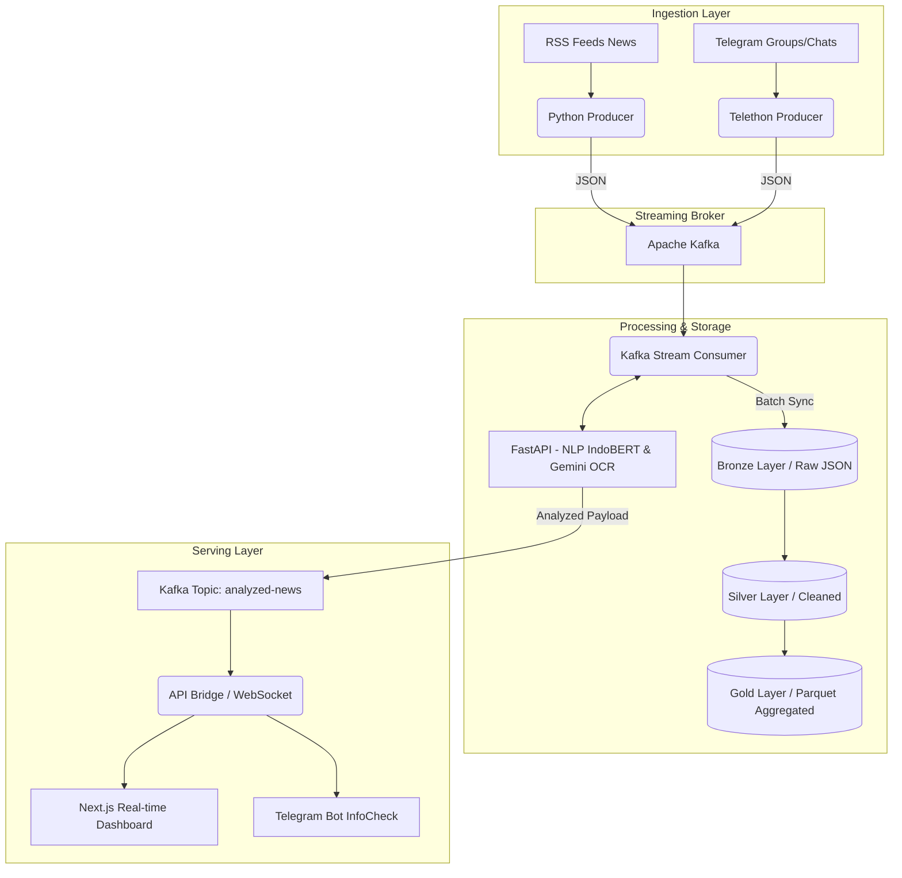
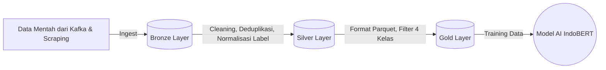

# 🛡️ InfoCheck ID V2 — Sistem Deteksi Hoaks & Penipuan Berbasis Big Data Real-Time

Selamat datang di repositori resmi **InfoCheck ID V2**. Sistem ini adalah platform pendeteksi berita hoaks dan penipuan (Scam) secara *real-time* yang memadukan arsitektur Big Data (Apache Kafka, Data Lakehouse) dengan kecerdasan buatan (IndoBERT NLP & Gemini OCR).

Proyek ini dirancang secara spesifik untuk memecahkan masalah penyebaran hoaks dan penipuan daring di Indonesia berskala masif, dengan memenuhi standar infrastruktur Big Data modern.

---

## 🎯 1. Identifikasi Masalah & Relevansi Big Data (Konsep 5V)

Penyebaran hoaks dan penipuan daring (seperti phising, lowongan kerja palsu, dan scam tiket konser) di Indonesia telah mencapai titik kritis. Data kuantitatif dari Kominfo mencatat ribuan isu hoaks baru setiap tahunnya yang merugikan masyarakat triliunan rupiah. Solusi tradisional tidak lagi mumpuni karena karakteristik data saat ini membutuhkan pendekatan **Big Data (5V)**:

1. **Volume**: Data teks, chat, dan gambar penipuan yang beredar di platform Telegram dan berita nasional mencapai jutaan pesan per hari.
2. **Velocity**: Kecepatan penyebaran hoaks sangat tinggi (*real-time*). Sistem harus mampu mendeteksi dan memfilter pesan dalam hitungan milidetik sebelum pesan tersebut viral.
3. **Variety**: Format data sangat beragam. Terdapat data teks terstruktur (berita), semi-terstruktur (JSON dari Telegram API), hingga data tidak terstruktur (Gambar/Screenshot penipuan).
4. **Veracity**: Tingkat keandalan informasi sangat bervariasi. Dibutuhkan model AI (IndoBERT) untuk memvalidasi tingkat kebenaran (Veracity) dari suatu teks.
5. **Value**: Hasil akhir (Value) berupa *dashboard* statistik *real-time* dan Bot interaktif yang menyelamatkan masyarakat dari kerugian finansial akibat penipuan.

**Gap Analisis:** Saat ini, sistem pengecekan fakta di Indonesia (seperti TurnBackHoax) masih mengandalkan pencarian manual oleh manusia (*human-in-the-loop*). Belum ada solusi terintegrasi yang mampu melakukan **pengecekan otomatis secara real-time** pada aliran *chat* dan mendeteksi teks di dalam gambar secara bersamaan.

---

## 🏛️ 2. Desain Infrastruktur Big Data & Justifikasi Teknologi

Sistem ini menerapkan pipeline data lengkap (*Ingestion, Storage, Processing, Serving*). Berikut adalah diagram arsitekturnya:



**Justifikasi Teknologi:**
- **Apache Kafka**: Dipilih karena kemampuannya menangani *throughput* data *streaming* yang sangat tinggi dengan latensi rendah, serta *fault-tolerance* yang menjaga pesan tidak hilang.
- **Data Lakehouse (Parquet)**: Menggabungkan fleksibilitas Data Lake dan struktur Data Warehouse. Format Parquet dipilih karena penyimpanannya berbasis kolom (columnar), sehingga sangat efisien untuk kueri analitik dan melatih ulang model Machine Learning.
- **FastAPI**: Dipilih sebagai jembatan AI karena performanya yang sangat cepat (asynchronous) dibandingkan Flask/Django.

---

## 🌊 3. Implementasi Data Lakehouse (Medallion Architecture)

Untuk menjamin kualitas data dalam skala besar, penyimpanan diimplementasikan menggunakan arsitektur Medallion:


1. **Bronze Layer (Raw Data)**: Data mentah apa adanya disimpan dalam format JSON. Termasuk data *scraping* Telegram dan `ocr_results.json` dari Gemini.
2. **Silver Layer (Cleaned Data)**: Data dibersihkan (menghilangkan karakter aneh, membetulkan typo, pembersihan spasi).
3. **Gold Layer (Aggregated/Business Level)**: Data diseleksi secara ketat menjadi 4 kelas absolut (Valid, Hoaks, Penipuan, Netral) agar *dataset* *balanced* (masing-masing 25%), lalu disimpan dalam partisi format **Parquet** (`final_dataset_balanced.parquet`). Format Parquet ini mengoptimalkan I/O saat proses *training* model besar.

---

## 🧠 4. Teknik Analisis Lanjutan & Keunikan Solusi

Proyek ini sangat inovatif karena menggabungkan **3 Teknologi Sinergis** sekaligus (Streaming + NLP + Computer Vision):

1. **Natural Language Processing (NLP)**: 
   - Model **IndoBERT v2** dilatih secara khusus (*Fine-Tuning*) untuk mendeteksi 4 kelas.
   - Evaluasi model menggunakan metrik *F1-Score* yang mencapai **98.2%** pada *Test Set* (sangat tangguh mengatasi *Class Imbalance*).
2. **Computer Vision (OCR - Gemini Vision)**:
   - Sistem mampu mengekstrak teks dari *screenshot* (seperti tangkapan layar penipuan tiket konser atau pinjol) dan menganalisisnya secara otomatis, sebuah fitur yang jarang dimiliki kompetitor pendeteksi hoaks konvensional.
3. **Kafka Real-time Streaming**:
   - Seluruh hasil NLP dan OCR ini disalurkan kembali dalam bentuk aliran data waktu nyata untuk disajikan di *Dashboard* statistik.

---

## 🏗️ Arsitektur Sistem & Pembagian Tugas Tim

Proyek ini dibangun oleh 6 anggota tim dengan peran masing-masing:

### 👤 Anggota 1: Infrastruktur Big Data & Ingestion (Kafka)
- **Tugas:** Menyiapkan *message broker* (Apache Kafka & Zookeeper) menggunakan Docker untuk menangani aliran data berkecepatan tinggi. Membangun produser data (RSS Feed) untuk menyedot berita secara otomatis.
- **Komponen:** `docker-compose.yml`, `producers/rss_producer.py`
- **Screenshot Hasil:**
  *(Tambahkan screenshot Terminal Docker/Kafka atau Log RSS Producer di sini)*
  ``

### 👤 Anggota 2: Data Engineering, Lakehouse, & OCR System
- **Tugas:** Mengumpulkan dataset raksasa (30.000+ baris), membersihkannya, dan membangun arsitektur Data Lakehouse (Bronze, Silver, Gold berformat Parquet). Juga mengintegrasikan OCR pintar (Gemini Vision) untuk mengekstrak teks dari gambar penipuan.
- **Komponen:** `dataset/`, `scripts/prepare_dataset.py`, `Screenshot/`
- **Screenshot Hasil:**
  *(Tambahkan screenshot proses pembuatan dataset atau hasil OCR gambar penipuan di sini)*
  ``

### 👤 Anggota 3: NLP & Machine Learning Model (IndoBERT)
- **Tugas:** Melatih model AI berbasis Deep Learning (IndoBERT 4 Kelas: Valid, Hoaks, Penipuan, Netral) dan membangun Baseline Model (TF-IDF) untuk performa ringan. Membuat REST API agar model bisa diakses oleh sistem lain.
- **Komponen:** `ml/nlp_baseline.py`, `scripts/kaggle_finetune_indobert.py`, `api/predict_api.py`
- **Screenshot Hasil:**
  *(Tambahkan screenshot grafik akurasi 98% dari Colab atau Swagger UI API di sini)*
  ``

### 👤 Anggota 4: Kafka Stream Consumer (Data Processing)
- **Tugas:** Menjadi jembatan antara aliran data (Kafka) dengan AI. Membaca data mentah secara *real-time*, mengirimkannya ke API AI untuk dianalisis, lalu mengembalikan hasilnya ke dalam topik Kafka baru (`analyzed-news`).
- **Komponen:** `consumers/stream_consumer.py`
- **Screenshot Hasil:**
  *(Tambahkan screenshot Terminal Consumer yang sedang menganalisis pesan)*
  ``

### 👤 Anggota 5: Frontend Dashboard & API Bridge
- **Tugas:** Membangun *dashboard* web yang cantik, dinamis, dan *real-time* untuk menampilkan statistik berita dan penipuan. Membangun API Bridge yang menyedot data analitik dari Kafka untuk ditampilkan ke layar pengguna.
- **Komponen:** `frontend/` (Next.js/React), `api_bridge/main.py`
- **Screenshot Hasil:**
  *(Tambahkan screenshot tampilan cantik Dashboard InfoCheck di sini)*
  ``

### 👤 Anggota 6: Telegram Bot Interaktif
- **Tugas:** Menciptakan *bot* Telegram responsif (`@InfoCheckID_Bot`) agar masyarakat awam bisa mengecek kebenaran berita atau mendeteksi gambar penipuan cukup dengan mengirim *chat* atau foto.
- **Komponen:** `bot/telegram_bot.py`
- **Screenshot Hasil:**
  *(Tambahkan screenshot percakapan Bot di HP / Telegram Web)*
  ``

---

## 🚀 Panduan Menjalankan Sistem Secara Lengkap (End-to-End)

Untuk mendemonstrasikan sistem ini, jalankan langkah-langkah berikut secara berurutan menggunakan **terminal yang berbeda-beda**.

> **Prasyarat:** Pastikan Docker Desktop sudah menyala dan dependensi Python sudah di-*install* (`pip install -r requirements.txt`).

### 1️⃣ Siapkan Data Lakehouse (Hanya 1x di awal)
```bash
python scripts/prepare_dataset.py
```
*(Menghasilkan `final_dataset_balanced.parquet` di layer Gold)*

### 2️⃣ Nyalakan Infrastruktur Kafka (Anggota 1)
```bash
docker-compose up -d
```
*(Tunggu 10 detik hingga Kafka & Zookeeper menyala)*

### 3️⃣ Nyalakan API Model AI (Anggota 3)
```bash
# Buka Terminal 1
python api/predict_api.py
```
*(Server AI akan standby di port 8000. Jika PyTorch tidak ada, ia otomatis menggunakan Baseline TF-IDF).*

### 4️⃣ Nyalakan Kafka Consumer (Anggota 4)
```bash
# Buka Terminal 2
python consumers/stream_consumer.py
```
*(Terminal akan diam "Menunggu pesan masuk dari Kafka stream...")*

### 5️⃣ Nyalakan API Bridge (Anggota 5 - Backend)
```bash
# Buka Terminal 3
python api_bridge/main.py
```

### 6️⃣ Nyalakan Dashboard Website (Anggota 5 - Frontend)
```bash
# Buka Terminal 4
cd frontend
npm run dev
```

### 7️⃣ Nyalakan Bot Telegram (Anggota 6)
```bash
# Buka Terminal 5
python bot/telegram_bot.py
```

### 8️⃣ Nyalakan Data Ingestion / Penarik Data (Anggota 1 & 2)
Untuk mulai mengalirkan data *real-time* ke dalam *Dashboard*, jalankan skrip-skrip pencari data berikut (bisa dijalankan salah satu atau semuanya secara bersamaan di terminal berbeda):

```bash
# Opsi 1: Menarik Berita RSS Nasional (Detik, Kompas, dll)
python producers/rss_producer.py

# Opsi 2: Menyadap Grup Penipuan Telegram 
# Catatan: Jika ditanya nomor HP, masukkan nomor HP-mu (misal: +62812...). Jangan gunakan token Bot agar tidak terjadi error saat menarik riwayat (history) pesan lama.
python producers/telegram_producer.py

# Opsi 3: Menarik Data Hoaks Resmi dari Kominfo/TurnBackHoax
python producers/scraper_kominfo.py

# Opsi 4: Simulator Twitter (Menghasilkan cuitan dummy bertema hoaks)
python producers/twitter_simulator_producer.py
```

🎉 **Selesai!** 
Sekarang coba buka Telegram dan kirim pesan ke Bot-mu, atau pantau layar *Dashboard* web-mu. Pesan dari Bot dan hasil tarikan berita (RSS/Telegram) akan mengalir ke Kafka (Anggota 1) $\rightarrow$ ditarik oleh Consumer (Anggota 4) $\rightarrow$ dianalisis oleh AI (Anggota 3) $\rightarrow$ hasilnya dikembalikan ke Kafka dan langsung muncul di Dashboard (Anggota 5) secara ajaib!

---

*Dikembangkan untuk Tugas Besar Big Data (Semester 4)*
